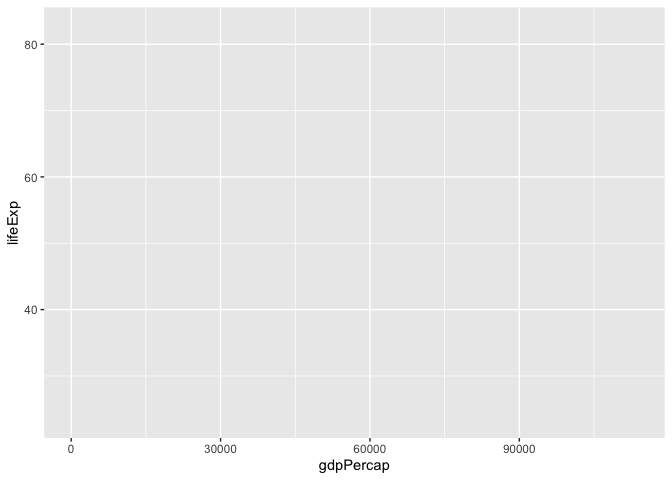
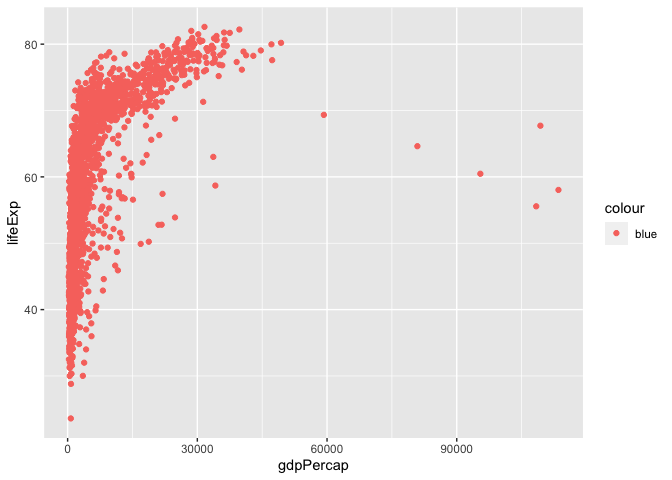
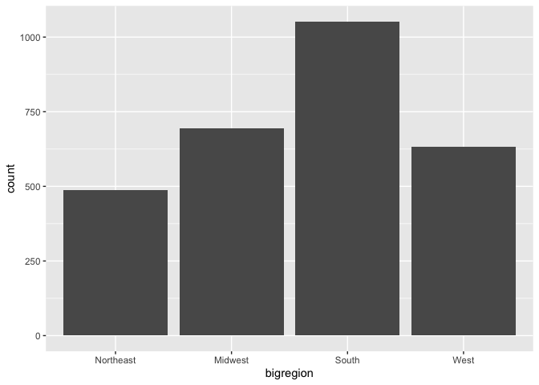
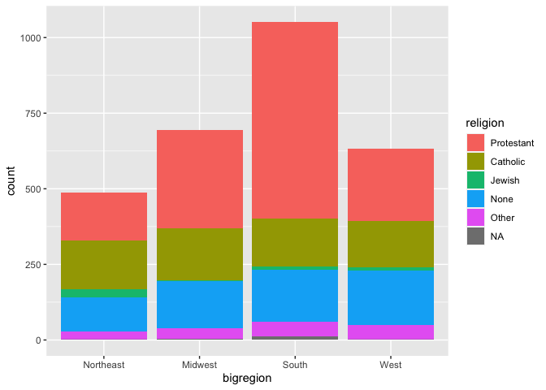
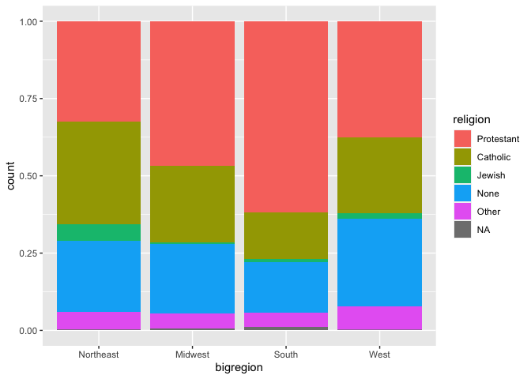
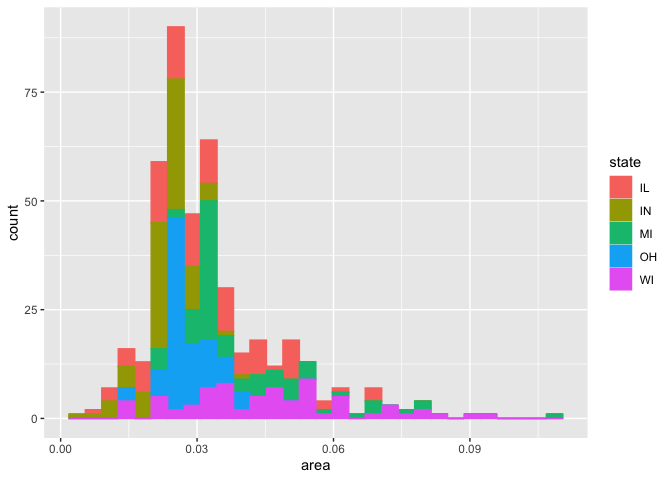

Increase Your Impact: Visualizations in R
================
dr. Mariken A.C.G. van der Velden

### Installing R and R Studio

During these tutorials, we will work with the software R. The
overwhelming majority of the R community nowadays works with the
interface *R Studio*. This is an integrated development environment, or
IDE, for R.

To download R, go to CRAN, the *comprehensive R archive network*. CRAN
is composed of a set of mirror servers distributed around the world and
is used to distribute R and R packages. Please use the cloud mirror:
*<https://cloud.r-project.org>*, which automatically figures out the
mirror closest to you. Note: A new version of R comes out once a year,
and there are 2-3 minor releases each year. It’s a good idea to update
regularly, despite the hassle that comes with updating.

Once R is installed, install R Studio from
*<http://www.rstudio.com/download>*.

When you start R Studio, you will see four regions in the interface: 1)
the code editor; 2) the R console; 3) the workspace and history; and 4)
plots, files, packages and help. See e.g.p.36 of the book.

You will also need to install some packages. An R *package* is a
collection of functions, data and documentation that extends the
capabilities of base R. Using packages is key to the successfull use of
R. The majority of packages we will work with in this course aer paert
of the so-called tidyverse. The packages in the tidyverse share a common
philosophy of data and R programming, and are designed to work together
naturally.

You can install the complete tidyverse with a single line of code:

``` r
#install.packages("tidyverse") ## uncomment the line by deleting the '#'
```

You can type the line of code either in R Studio’s console or code
editor. For the former, you just have to press enter, for the latter you
press Shift/enter (Windows) or command/enter (Mac). R will download the
packages from CRAN and install them onto your computer.

You will not be able to use the functions, objects, and help files in a
package until you load it with `library()`. Once you have installed a
package, you can load it with the `library()` function:

``` r
library(tidyverse)
```

This tells you that tidyverse is loading the **gpglot2**, **tibble**,
**tidyr**, **readr**, **purrr**, **dplyr**, **stringr**, and **forcats**
packeges. These form the core of the tidyverse. Packages in the
tidyverse cchange fairly frequently. You can see if updates are
available, and optionally install them, by running `tidyverse_update()`.

When you will need other packages during the tutorials, this will always
be stated explicitly in the assignment.

### Running R Code

In the R console of R Studio, every line of code generally contains a
command or instruction for the computer to do or calculate something
(formally, such commands are often called statements). Like you learned
in Python during the *Computational Thinking* course. In its simplest
form, you can ask R to do simple sums, such as `2+2`:

``` r
2+2
```

    ## [1] 4

(note that the line `## [1] 4` is the output of this command: a single
value 4)

Throughout the tutorials, we use a consistent set of conventions to
refer to code:

  - Functions are in a code font and followed by parentheses, like
    `sum()` or `mean()`. *Note*: If you like to explore a function use
    `?` in front of that function, e.g. `?sum`, and the explanation
    appears in the lower right panel of your R Studio.
  - Other R objects (like data or function arguments) are in code font,
    without parentheses, like `x`.
  - If we want to make clear what package an object comes from, we will
    use the package name followed by two colons, like `dplyr::mutate()`
    or `ggplot2:ggplot()`. This is also valid R code.

### Data Visualization with ggplot2

During the course, we will learn you to visualize data using
**ggplot2**. R has several systems for making graphs, but **ggplot2** is
one of the most elegant and most versatile. **ggplot2** implements the
*grammar of graphics*, a coherent systems for describing and building
graphs. If you’d like to learn more about the theoretical underpinnings
of **ggplot2**, I would recommend reading “A Layered Grammar of
Graphics” (*<http://vita.had.co.nz/papers/layered-grammar.pdf>*)

The **layered grammar of graphics** tells us that a statistical graphic
is a **mapping from data to aesthetic attributes** (colour, shape, size)
**of geometric objects** (points, lines bars). In a formula, this looks
like the following:

`Data + Aesthetic mappings + Layers` (Geometric objects, Stats ) `+
Scales + Coordinate system + Faceting + Theme`

Key Components of that formula are: \* **Data** = a data frame \* A set
of **aesthetic mappings** between variables in the data and visual
properties (e.g. horizontal and vertical position, size, color and
shape) \* And at least one layer (describes how to render the
observations; usually created with a **geom** function, e.g.
`geom_point()`

### *Assignment 1a: Try a simple scatter plot*

In this assignment, we will practice to get a little familiar with the
above described key components of the grammar of graphics.

If you’d like to know whether areas in which more people with a college
degree live are more likely to have low levels of poverty, we can use
the `midwest` data to make a simple scatter plot, using the following
key components:

  - **Data** = `midwest`, you can inspect the data with either
    `head(midwest)` or `str(midwest)`
  - **Aesthetic mappings** = percent college educated (variable
    `percollege` in `midwest`) mapped to x position, percent adult
    poverty (variable `percadultpoverty` in `midwest`) mapped to y
    position
  - **Layer** = `geom_points()`

This leads to the following code:

``` r
ggplot(midwest, aes(x = percollege, y = percadultpoverty)) +
geom_point()
```

<!-- -->

``` r
## There are two other ways to write the code for the same outcome.
#ggplot(midwest) +
#geom_point(aes(x = percollege, y = percadultpoverty))

#ggplot() +
#geom_point(data = midwest, aes(x = percollege, y = percadultpoverty))
```

*1a) Replicate the codes and check whether you get three times the same
graph. Pay attention, when `ggplot()` is empty, you need to specify
which data you use, using the `data =` statement in the layer
`geom_point()`.*

*1b) Explore the options of `geom_point()` by adding a color to the
points based on the values of `percadultpoverty`. Add only the used code
into your assignment.*

*1c) While the different colors for percent adult poverty (variable
`percadultpoverty`) give us un overview of the severity of adult poverty
in the entire region the Midwest in the US. We might also want to know
whether some states are worse of than others. Explore the options of
`geom_point()` by adding a color to the points based on the values of
`state`. Add only the used code into your assignment.*

*1d) To combine both the variation in state and severity of adult
povert, add a color for `percadultpoverty` to the figure and shapes for
the different states. Add the code to your assignment.*

*1e) The figure created in 1e might become hard to read. Therefore,
instead of using shapes for states, you can use `facet_grid` to split
the graph on state. Explore this command. You can also try out different
fixed colors for `percadultpoverty` looking at
<http://www.stat.columbia.edu/~tzheng/files/Rcolor.pdf>. Pay attention,
when you want to fix a color, it needs to be outside the `aes` statement
and in between “…”. Add the code and the figure to your assignment. You
can save the plot either by clicking on the “Export” button in the lower
right panel or use `ggsave()`.*

### Mapping of variables

There is some structured relationship, some *mapping*, between the
variables in your data and their representation in the plot displayed.
Not all mappings make sense for all types of variables, and
(independently of this) some representations are harder to interpret
than others.

`ggplot2` provides you with a set of tools to map data to visual
elements on your plot, to specify the kind of plot you want, and then to
control the fine details of how it will be displayed. Figure 3.1 (p. 56
in the book) demonstrates the workflow of `ggplot2`.

The most important thing to get used to with `ggplot2`, and we played a
little with this in last week’s tutorial, is the way you use it to think
about the logical structure of your plot. The code you write - and wrote
- specifies the connections between your data and the plot elements, and
the colors, points, and shapes you see on the screen. In `ggplot2`,
these logical connections between your data and the plot elements are
called *aesthetic mappings* or just *aesthetics*.

You begin every plot by telling the `ggplot()` function what your data
is and how the variables in this data logically map onto the plot’s
aesthetics. Once you’ve specified the aesthetics, you specify the layers
with one of the `geom_` functions.

### Geoms: an overview

To represent distributions for:

  - Continuous variables: `geom_dotplot()`, `geom_histogram()`,
    `geom_freqpoly()`, `geom_density()`

  - Categorical variables: `geom_bar()`, `geom_text()` (also: summary of
    continuous variable)

To represent relationships:

  - Between a continuous and a factor variable: `geom_boxplot()`,
    `geom_jitter()`, `geom_violin()`, `geom_point()`

  - Between a summarized continuous variable and a factor variable:
    `geom_bar(stat="identity")`

  - Between two continuous variables: `geom_point()`,
    `geom_smooth(method = c("loess", "gam", "lm", "rlm"))`

To represent time series and areas:

  - `geom_lines()`, `geom_path()`, `geom_area()`, `geom_polygon()`,
    `geom_tile()`

### Reshaping data to visualize

Sometimes data frames are stored into a so-called *long-format*, other
times they are stored in a *wide-format*. In a long-format table, every
variable is a column and every row is an observation. In a wide-format
table, some variables are spread out over multiple columns. For example,
different years, as displayed in Table 3.1 (p. 57 of the book). We can
remind ourselves with what type of data we’re dealing by typing
`head(data)` in the console to display the first 6 rows by default. For
example:

``` r
#install.packages("gapminder") # uncomment this if you have not installed the package yet.
library(gapminder)

head(gapminder)
```

    ## # A tibble: 6 x 6
    ##   country     continent  year lifeExp      pop gdpPercap
    ##   <fct>       <fct>     <int>   <dbl>    <int>     <dbl>
    ## 1 Afghanistan Asia       1952    28.8  8425333      779.
    ## 2 Afghanistan Asia       1957    30.3  9240934      821.
    ## 3 Afghanistan Asia       1962    32.0 10267083      853.
    ## 4 Afghanistan Asia       1967    34.0 11537966      836.
    ## 5 Afghanistan Asia       1972    36.1 13079460      740.
    ## 6 Afghanistan Asia       1977    38.4 14880372      786.

### Steps to build a plot

Let’s say we want to plot life expectancy against per capita GDP for all
country-years in the data. We’ll do this by ccreating an object that has
some of the necessary information in it and build it up from there.
First, we have to tell the `ggplot()`function what data we are using:

``` r
p <- ggplot(data = gapminder)
```

Now, `ggplot()` knows the data, but not yet the *mapping*: we need to
tell which variables in the data should be represented by which visual
elements in the plot. In `gpglot2`, mappings are specified using the
`aes()` function.

``` r
p <- ggplot(data = gapminder, mapping = aes(x = gdpPercap, y = lifeExp))
```

The code above gives `ggplot()` two arguments: 1) `data`; and 2)
`mapping`. The latter thus *links variables* to *things you will see* on
the plot. The `x` and `y` values are the most obvious aesthetics. Other
aesthetic mappings include color, shape, size, and linetype.

It is important to note that a mapping does not directly say what
particular colors or shapes, for example, will be on the plot. Rather,
it says which *variables* in the data will be *represented* by visual
elements.

So, what happens if we type in the object `p` in the R console?

``` r
p
```

<!-- -->

``` r
## the other way to immediately tell R to show the object is:
## (p <- ggplot(data = gapminder))
```

The `p` object has been created by the `ggplot()` function and has
information in it about the mappings we want, together with a lot of
other information added by default. If you want to see how much
information, check `str(p)`. Yet, what is still not in the object `p` is
any information on the layers - i.e. instructions as we have seen last
week on what plot to draw.

Let’s create a scatterplot:

``` r
p + geom_point()
```

<!-- -->

### *Assignment 2: Mappings & Layers*

*2a) In Assignment 1, you’ve practiced with adding colors to the graph.
What is going wrong with the following code? Repair the code.*

``` r
library(tidyverse) 
ggplot(data = gapminder) +
  geom_point(mapping = aes(x = gdpPercap, y = lifeExp, color = "blue"))
```

<!-- -->

*2b) Use the same mappings as used in object `p` but instead use a
different `geom`. Add a `geom_smooth` as a layer.*

*2c) What happens when you put the `geom_smooth()` function before
`geom_point()` instead of after it? What does this tell you about how
the plot is drawn? Think about how this might be useful when drawing
plots.*

*2d) In the plot, the data is quite bunched up against the left side.
Gross Domestic Product per capita is not normally distributed across our
country years. The x-axis scale would probably look better if it were
transformed from a linear scale to a log scale. For this we can use a
function called `scale_x_log10()`. Add this function to the plot and
describe what happens.*

*2e) Try some alternative scale mappings. Besides `scale_x_log10()` you
can try `scale_x_sqrt()` and `scale_x_reverse()`. There are
corresponding functions for y-axis transformations. Just write y instead
of x. Experiment with them to see what sort of effect they have on the
plot, and whether they make any sense to use.*

*2f) What happens if you map `color` to `continent`? And what happens if
you map it to `year`?*

*1g) Instead of mapping `color = year`, what happens if you try `color =
factor(year)`?*

To save plots, you can use `ggsave()` (See section 3.7 of the book).

### Show the right numbers

When you write ggplot code in R you are in effect trying to “say”"
something visually. It usually takes several iterations to say exactly
what you mean. This is more than a metaphor here. The ggplot library is
an implementation of the “grammar” of graphics, an idea developed by
Wilkinson (2005) (<https://www.springer.com/gp/book/9780387245447>). The
grammar is a set of rules for producing graphics from data, taking
pieces of data and mapping them to geometric objects (like points and
lines) that have aesthetic attributes (like position, color and size),
together with further rules for transforming the data if needed (e.g. to
a smoothed line), adjusting scales (e.g. to a log scale) and projecting
the results onto a different coordinate system (usually cartesian).

A key point is that, like other rules of syntax, the grammar limits the
structure of what you can say, but it does not automatically make what
you say sensible or meaningful. It allows you to produce long
“sentences” that begin with mappings of data to visual elements and
add clauses about what sort of plot it is, how the axes are scaled, and
so on. But these sentences can easily be garbled. Sometimes your code
will not produce a plot at all because of some syntax error in R. You
will forget a `+` sign between `geom_` functions, or lose a parenthesis
somewhere so that your function statement becomes unbalanced. In those
cases R will complain (perhaps in an opaque way) that something has gone
wrong. At other times, your code will successfully produce a plot, but
it will not look the way you expected it to. Sometimes the results will
look very weird indeed. In those cases, the chances are you have given
ggplot a series of grammatically correct instructions that are either
nonsensical in some way, or have accidentally twisted what you meant to
say. These problems often arise when ggplot does not have quite all the
information it needs in order make your graphic say what you want it to
say.

### *Assignment 3: Which Numbers to Plot*

*3a) Imagine we wanted to plot the trajectory of life expectancy over
time for each country in the data. We map `year` to x and `lifeExp` to
y. We take a quick look at the documentation and discover that
`geom_line()` will draw lines by connecting observations in order of the
variable on the x-axis, which seems right. Run the code below. What
happened?*

``` r
(p <- ggplot(data = gapminder,
            mapping = aes(x = year,
                          y = gdpPercap)) +
     geom_line())
```

While ggplot will make a pretty good guess as to the structure of the
data, it does not know that the yearly observations in the data are
grouped by country. We have to tell it. Because we have not,
\`geom\_line() gamely tries to join up all the lines for each particular
year in the order they appear in the dataset, as promised. It starts
with an observation for 1952 in the first row of the data. It doesn’t
know this belongs to Afghanistan. Instead of going to Afghanistan 1953,
it finds there are a series of 1952 observations, so it joins all of
those up first, alphabetically by country, all the way down to the 1952
observation that belongs to Zimbabwe. Then it moves to the first
observation in the next year, 1957.This would have worked if there were
only one country in the dataset.

The result is meaningless when plotted. Bizarre-looking output in ggplot
is common enough, because everyone works out their plots one bit at a
time, and making mistakes is just a feature of puzzling out how you want
the plot to look. When ggplot successfully makes a plot but the result
looks insane, the reason is almost always that something has gone wrong
in the mapping between the data and aesthetics for the geom being used.
This is so common there’s even a Twitter account devoted to the
“Accidental aRt” that results. So don’t despair\!

In this case, we can use the `group` aesthetic to tell ggplot explicitly
about this country-level structure:

``` r
(p <- ggplot(data = gapminder,
            mapping = aes(x = year,
                          y = gdpPercap)) +
  geom_line(aes(group=country))) 
```

<!-- -->

The plot here is still fairly rough, but it is showing the data
properly, with each line representing the trajectory of a country over
time. The gigantic outlier is Kuwait, in case you are interested.

The `group` aesthetic is usually only needed when the grouping
information you need to tell ggplot about is not built-in to the
variables being mapped. For example, when we were plotting the points by
continent, mapping `color` to `continent` was enough to get the right
answer, because `continent` is already a categorical variable, so the
grouping is clear. When mapping the `x` to `year`, however, there is no
information in the `year` variable itself to let ggplot know that it is
grouped by country for the purposes of drawing lines with it. So we need
to say that explicitly.

The plot we just made has a lot of lines on it. While the overall trend
is more or less clear, it looks a little messy. One option is to *facet*
the data by some third variable, making a “small multiple” plot. This is
a very powerful technique that allows a lot of information to be
presented compactly, and in a consistently comparable way. A separate
panel is drawn for each value of the faceting variable. Facets are not a
geom, but rather a way of organizing a series of geoms. In this case we
have the `continent` variable available to us. We will use
`facet_wrap()` to split our plot by `continent`.

The `facet_wrap()` function can take a series of arguments, but the most
important is the first one, which is specified using R’s “formula”
syntax, which uses the tilde character, `~`. Facets are usually a
one-sided formula. Most of the time you will just want a single variable
on the right side of the formula. But faceting is powerful enough to
accommodate what are in effect the graphical equivalent of multi-way
contingency tables, if your data is complex enough to require that. For
our first example, we will just use a single term in our formula, which
is the variable we want the data broken up by: `facet_wrap(~
continent)`.

``` r
p <- ggplot(data = gapminder,
            mapping = aes(x = year,
                          y = gdpPercap))
p + geom_line(aes(group = country)) + 
  facet_wrap(~ continent)
```

<!-- -->

*3b) Work with ggplot’s `mpg` data - to inspect the data set, type
`?mpg` in the Console. What plots does the following code make? What
does `.` do?*

``` r
ggplot(data = mpg) + 
  geom_point(mapping = aes(x = displ, y = hwy)) +
  facet_grid(drv ~ .)

ggplot(data = mpg) + 
  geom_point(mapping = aes(x = displ, y = hwy)) +
  facet_grid(. ~ cyl)
```

*3c) Read `?facet_wrap`. What does `nrow` do? What does `ncol` do? What
other options control the layout of the individual panels? Why doesn’t
`facet_grid()` have `nrow` and \`ncol arguments?*

*3d) When using `facet_grid()` you should usually put the variable with
more unique levels in the columns. Why?*

### Geoms Can Transform Data

We have already seen several examples where `geom_smooth()` was included
as a way to add a trend line to the figure. Sometimes we plotted a LOESS
line, sometimes a straight line from an OLS regression, and sometimes
the result of a Generalized Additive Model. We did not have to have any
strong idea of the differences between these methods. Neither did we
have to write any code to specify the underlying models, beyond telling
the method argument in `geom_smooth()` which one we wanted to use. The
`geom_smooth()` function did the rest.

Thus, some geoms plot our data directly on the figure, as is the case
with `geom_point()`, which takes variables designated as x and y and
plots the points on a grid. But other geoms clearly do more work on the
data before it gets plotted.Try `p + stat_smooth()`, for example. Every
`geom_` function has an associated `stat_` function that it uses by
default. The reverse is also the case: every `stat_` function has an
associated `geom_` function that it will plot by default if you ask it
to. This is not particularly important to know by itself, but as we will
see in the next section, we sometimes want to calculate a different
statistic for the geom from the default.

Sometimes the calculations being done by the `stat_` functions that work
together with the `geom_` functions might not be immediately obvious.
For example, consider this figure produced by a new geom, `geom_bar()`.

``` r
#install.packages("remotes")
#remotes::install_github("kjhealy/socviz")
library(socviz)
p <- ggplot(data = gss_sm,
            mapping = aes(x = bigregion))
p + geom_bar()
```

<!-- -->

Here we specified just one mapping, `aes(x = bigregion)`. The bar chart
produced gives us a count of the number of (individual) observations in
the data set by region of the United States. This seems sensible. But
there is a y-axis variable here, `count`, that is not in the data. It
has been calculated for us. Behind the scenes, `geom_bar` called the
default `stat_` function associated with it, `stat_count()`. This
function computes two new variables, `count`, and `prop` (short for
proportion). The `count` statistic is the one \`geom\_bar() uses by
default.

``` r
p <- ggplot(data = gss_sm,
            mapping = aes(x = bigregion))
p + geom_bar(mapping = aes(y = ..prop..))
```

<!-- -->

### *Assignment 4: Geoms and Transformations*

*Let’s look at another question from the survey. The `gss_sm` data
contains a `religion` variable derived from a question asking “What is
your religious preference? Is it Protestant, Catholic, Jewish, some
other religion, or no religion?”*

*4a) Run the code below. What is the difference in outcome?*

``` r
p <- ggplot(data = gss_sm,
            mapping = aes(x = religion, color = religion))
p + geom_bar()

p <- ggplot(data = gss_sm,
            mapping = aes(x = religion, fill = religion))
p + geom_bar() + guides(fill = FALSE)  
```

*4b) A more appropriate use of the `fill` aesthetic with `geom_bar()` is
to cross-classify two categorical variables. This is the graphical
equivalent of a frequency table of counts or proportions. Using the GSS
data, for instance, we might want to examine the distribution of
religious preferences within different regions of the United States.
Let’s say we want to look at religious preference by census region.
That is, we want the `religion` variable broken down proportionally
within `bigregion`. When we cross-classify categories in bar charts,
there are several ways to display the results. With `geom_bar()` the
output is controlled by the `position` argument. Let’s begin by mapping
`fill to`religion\`. Replicate the following graph:*

<!-- -->

The default output of `geom_bar()` is a stacked bar chart, with counts
on the y-axis (and hence counts within the stacked segments of the bars
also). Region of the country is on the x-axis, and counts of religious
preference are stacked within the bars. It is somewhat difficult for
readers of the chart to compare lengths an areas on an unaligned scale.
So while the relative position of the bottom categories are quite clear
(thanks to them all being aligned on the x-axis), the relative positions
of say, the “Catholic” category is harder to assess. An alternative
choice is to set the `position` argument to “`fill`”. (This is different
from the `fill` aesthetic.) Now the bars are all the same height, which
makes it easier to compare proportions across groups:

``` r
p <- ggplot(data = gss_sm,
            mapping = aes(x = bigregion, fill = religion))
p + geom_bar(position = "fill")
```

<!-- -->

Different geoms transform data in different ways, but ggplot’s
vocabulary for them is consistent. We can see similar transformations at
work when summarizing a continuous variable using a histogram, for
example. A histogram is a way of summarizing a continuous variable by
chopping it up into segments or “bins” and counting how many
observations are found within each bin. In a bar chart, the categories
are given to us going in (e.g., regions of the country, or religious
affiliation). With a histogram, we have to decide how finely to bin the
data.

For example, ggplot comes with a dataset, `midwest`, containing
information on counties in several midwestern states of the USA.
Counties vary in size, so we can make a histogram showing the
distribution of their geographical areas. Area is measured in square
miles. Because we are summarizing a continuous variable using a series
of bars, we need to divide the observations into groups, or bins, and
count how many are in each one. By default, the `geom_histogram()`
function will choose a bin size for us based on a rule of thumb.

*4c) Pick a value for `stat_bin()` to improve the graph below.*

``` r
p <- ggplot(data = midwest,
            mapping = aes(x = area))
p + geom_histogram()
```

*4d) While histograms summarize single variables, it is also possible to
use several at once to compare distributions.* *We can facet histograms
by some variable of interest, or as here we can compare them in the same
plot using the `fill` mapping. Yet, the code below does not give us a
great overview of the data:*

``` r
p <- ggplot(data = midwest, 
            mapping = aes(x = area, fill = state, color = state))
p + geom_histogram()
```

<!-- -->

*It’s better to use `geom_density()`. Replicate the following graph.
(Note: To make the colors more opaque, use the `alpha` statement, you
can check this in `?geom_density`)*

``` r
p <- ggplot(data = midwest,
            mapping = aes(x = area, fill = state, color = state))
p + geom_density(alpha = 0.3)
```

*4e) Frequency polygons are closely related to histograms. Instead of
displaying the count of observations using bars, they display it with a
series of connected lines instead. Try Figure 4.15 of the book using
`geom_freqpoly()` instead.*

*4f) Density estimates can also be drawn in two dimensions. The
`geom_density_2d()` function draws contour lines estimating the joint
distribution of two variables. Try it with the `midwest` data, for
example, plotting percent below the poverty line (`percbelowpoverty`)
against percent college-educated (`percollege`). Try it with and without
a \`geom\_point() layer.*

### References

Healy, K. (2018). *Data visualization: a practical introduction*.
Princeton University Press. (*<https://socviz.co/>*)
