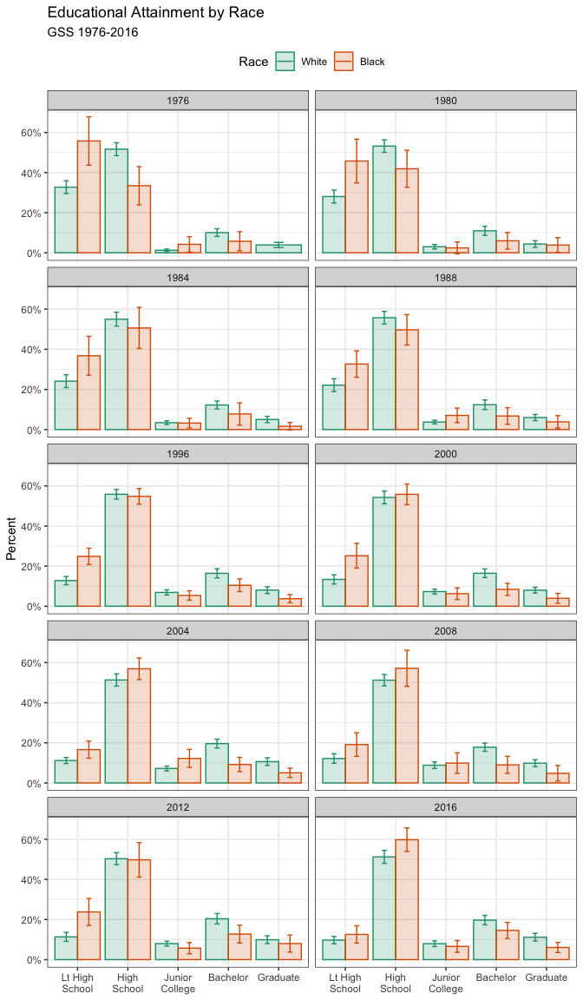
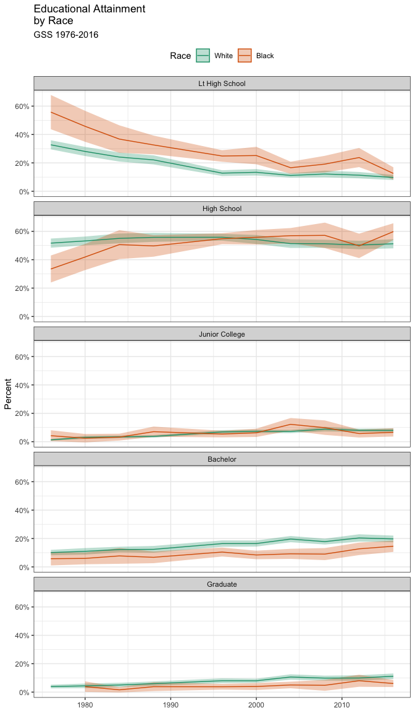

Increase Your Impact: Visualizations in R
================
dr. Mariken A.C.G. van der Velden

### Visualizing Survey Data

Social scientists often work with data collected using a complex survey
design. Survey instruments may be stratified by region or some other
characteristic, contain replicate weights to make them comparable to a
reference population, have a clustered structure, and so on. In Chapter
4 of the book of Healy, you can check how to calculate and then plot
frequency tables of categorical variables, using some data from the
General Social Survey (GSS). However, if we want accurate estimates of
US households from the GSS, we will need to take the survey’s design
into account, and use the survey weights provided in the dataset. Thomas
Lumley’s `survey` library provides a comprehensive set of tools for
addressing these issues. The tools and the theory behind them are
discussed in detail in Lumley (2010), and an overview of the package is
provided in Lumley (2004). While the functions in the `survey` package
are straightforward to use and return results in a generally `tidy`
form, the package predates the `tidyverse` and its conventions by
several years. This means we cannot use `survey` functions directly with
`dplyr`. However, Greg Freedman Ellis has written a helper package,
`srvyr`, that solves this problem for us, and lets us use the `survey`
library’s functions within a data analysis pipeline in a familiar way.

For example, the \`gss\_lon data contains a small subset of measures
from every wave of the GSS since its inception in 1972. It also contains
several variables that describe the design of the survey and provide
replicate weights for observations in various years. These technical
details are described in the GSS documentation. Similar information is
typically provided by other complex surveys. Here we will use this
design information to calculate weighted estimates of the distribution
of educational attainment by race, for selected survey years from 1976
to 2016.

To begin, we load the `survey` and `srvyr`
libraries.

``` r
# remember, if you have not installed the packages yet, use install.packages()
library(survey)
library(srvyr)
library(tidyverse)
library(socviz)
```

Next, we take our `gss_lon` dataset and use the `survey` tools to create
a new object that contains the data, as before, but with some additional
information about the survey’s design:

``` r
options(survey.lonely.psu = "adjust")
options(na.action="na.pass")

gss_wt <- subset(gss_lon, year > 1974) %>%
    mutate(stratvar = interaction(year, vstrat)) %>%
    as_survey_design(ids = vpsu,
                     strata = stratvar,
                     weights = wtssall,
                     nest = TRUE)
```

The two `options` set at the beginning provide some information to the
`survey` library about how to behave. You should consult Lumley (2010)
and the `survey` package documentation for details. The subsequent
operations create `gss_wt`, an object with one additional column
(`stratvar`), describing the yearly sampling strata. We use the
`interaction()` function to do this. It multiplies the `vstrat` variable
by the `year` variable to get a vector of stratum information for each
year. We have to do this because of the way the GSS codes its stratum
information. In the next step, we use the `as_survey_design()` function
to add the key pieces of information about the survey design. It adds
information about the sampling identifiers (`ids`), the strata
(`strata`), and the replicate weights (`weights`). With those in place
we can take advantage of a large number of specialized functions in the
survey library that allow us to calculate properly weighted survey means
or estimate models with the correct sampling specification. For example,
we can easily calculate the distribution of education by race for a
series of years from 1976 to 2016. We use `survey_mean()` to do this:

``` r
out_grp <- gss_wt %>%
    filter(year %in% seq(1976, 2016, by = 4)) %>%
    group_by(year, race, degree) %>%
    summarize(prop = survey_mean(na.rm = TRUE))
```

This gives us the numbers that we want and returns them in a tidy data
frame. The `interaction()` function produces variable labels that are a
compound of the two variables we interacted, with each combination of
categories separated by a period, (such as `White.Graduate`). However,
perhaps we would like to see these categories as two separate columns,
one for race and one for education, as before. Because the variable
labels are organized in a predictable way, we can use one of the
convenient functions in the `tidyverse`’s `tidyr` library to separate
the single variable into two columns while correctly preserving the row
values. Appropriately, this function is called `separate()`.

``` r
out_mrg <- gss_wt %>%
    filter(year %in% seq(1976, 2016, by = 4)) %>%
    mutate(racedeg = interaction(race, degree)) %>%
    group_by(year, racedeg) %>%
    summarize(prop = survey_mean(na.rm = TRUE)) %>%
    separate(racedeg, sep = "\\.", into = c("race", "degree"))
```

The call to `separate()` says to take the `racedeg` column, split each
value when it sees a period, and reorganize the results into two
columns, `race` and `degree`. This gives us a tidy table much like
`out_grp`, but for the marginal frequencies.

Reasonable people can disagree over how best to plot a small multiple of
a frequency table while faceting by year, especially when there is some
measure of uncertainty attached. A barplot is the obvious approach for a
single case, but when there are many years it can become difficult to
compare bars across panels. This is especially the case when standard
errors or confidence intervals are used in conjunction with bars. This
is sometimes called a *dynamite plot*, not because it looks amazing but
because the t-shaped error bars on the tops of the columns make them
look like cartoon dynamite plungers. An alternative is to use a line
graph to join up the time observations, faceting on educational
categories instead of year.

<!-- -->

This plot has a few cosmetic details and adjustments that you can look
up in Healy’s book (Chapter 8). **Try to replicate the plot by peeling
back the plot from the bottom, one instruction at a time, to see what
changes**. One useful adjustment to notice is the new call to the
`scales` library to adjust the labels on the x-axis. The adjustment on
the y-axis is `scales::percent` to convert the proportion to a
percentage. On the x-axis, the issue is that several of the labels are
rather long. If we do not adjust them they will print over one another.
The `scales::wrap_format()` function will break long labels into lines.
It takes a single numerical argument (here 10) that is the maxmimum
length a string can be before it is wrapped onto a new line.

A graph like this is true to the categorical nature of the data, while
showing the breakdown of groups within each year. But you should
experiment with some alternatives. For example, we might decide that it
is better to facet by degree category instead, and put the `year` on the
x-axis within each panel. If we do that, then we can use `geom_line()`
to show a time trend, which is more natural, and `geom_ribbon()` to show
the error range. This is perhaps a better way to show the data,
especially as it brings out the time trends within each degree category,
and allows us to see the similarities and differences by racial
classification at the same time. **Try to replicate the plot below
too**.

<!-- -->

#### Additional Assignment to Practice with Making Graphs out of Survey Data

Lineplots are used to display time series. Use the `economics` dataset
available in ggplot2 for this exercise. Show how the unemployment rate
has changed since the 1960s in the US, and especially since the
beginning of the financial crisis.

1.  Based on the `economics` dataset, generate a new dataset (`econ`)
    that includes a variable for unemployment rate and a dummy variable
    that separates the time before the beginning of the financial crisis
    from the period after the crisis (`as.Date(date) < "2008-10-01"`).

2.  Draw a line plot that shows the unemployment rate over time.

3.  Display years in 5- year steps on the x-axis.

4.  Add a colored vertical line at October 2008 (more precisely:
    `intercept = as.numeric(as.Date("2008-10-01"))`).

5.  Add the text “financial crisis” to the horizontal line.

6.  Remove the title on x-axis

### Visualizing Maps

R has a huge and growing number of spatial data packages. We recommend
taking a quick browse on R’s main website to see the spatial packages
available: *<http://cran.r-project.org/web/views/Spatial.html>*.

In this tutorial we will use the following packages:

  - **ggmap**: extends the plotting package `ggplot2` for maps

  - **rgdal**: R’s interface to the popular C/C++ spatial data
    processing library `gdal`

  - **rgeos**: R’s interface to the powerful vector processing library
    `geos`

  - **maptools**: provides various mapping functions

  - **dplyr** and **tidyr**: fast and concise data manipulation packages

  - **tmap**: a new packages for rapidly creating beautiful maps

<!-- end list -->

``` r
x <- c("ggmap", "rgdal", "rgeos", "maptools", "tidyverse", "tmap")
#install.packages(x) # warning: uncommenting this may take a number of minutes
lapply(x, library, character.only = TRUE) # load the required packages
```

The first file we are going to load into R Studio is the `london_sport`
shapefile. The data can be downloaded from:
*<https://github.com/Robinlovelace/Creating-maps-in-R>*. It is worth
looking at this input dataset in your file browser before opening it in
R. You will notice that there are several files named “london\_sport”“,
all with different file extensions. This is because a shapefile is
actually made up of a number of different files, such as .prj, .dbf and
.shp. You could also try opening the file”london\_sport.shp" file in a
conventional GIS such as QGIS to see what a shapefile contains. Once you
think you understand the input data, it’s time to open it in R. There
are a number of ways to do this, the most commonly used and versatile of
which is readOGR. This function, from the `rgdal` package, automatically
extracts the information regarding the data. `rgdal` is R’s interface to
the “Geospatial Abstraction Library (GDAL)” which is used by other open
source GIS packages such as QGIS and enables R to handle a broader range
of spatial data formats.

``` r
lnd <- readOGR(dsn = "data", layer = "london_sport")
```

    ## OGR data source with driver: ESRI Shapefile 
    ## Source: "/Users/marikenvandervelden/Dropbox/Desktop/GSSS/data-visualizations-workshop/data", layer: "london_sport"
    ## with 33 features
    ## It has 4 fields
    ## Integer64 fields read as strings:  Pop_2001

`readOGR` is a function which accepts two arguments: `dsn` which stands
for “data source name” and specifies the directory in which the file is
stored, and `layer` which specifies the file name (note that there is no
need to include the file extention .shp). The arguments are separated by
a comma and the order in which they are specified is important. You do
not have to explicitly type `dsn =` or `layer =` as R knows which order
they appear, so `readOGR("data", "london_sport")` would work just as
well. For clarity, it is good practice to include argument names when
learning new functions so we will continue to do so. The file we
assigned to the `lnd` object contains the population of London Boroughs
in 2001 and the percentage of the population participating in sporting
activities. This data originates from the Active People Survey. The
boundary data is from the Ordnance Survey. For information about how to
load different types of spatial data, see the help documentation for
`readOGR`. This can be accessed by typing `?readOGR`. For another worked
example, in which a GPS trace is loaded, please see Cheshire and
Lovelace (2014).

Spatial objects like the `lnd` object are made up of a number of
different slots, the key slots being `@data` (non geographic attribute
data) and `@polygons` (or `@lines` for line data). The data slot can be
thought of as an attribute table and the geometry slot is the polygons
that make up the physcial boundaries. Specific slots are accessed using
the `@` symbol. Let’s now analyse the sport object with some basic
commands:

``` r
head(lnd@data, n = 2)
mean(lnd$Partic_Per) 
```

Now we have seen something of the structure of spatial objects in R, let
us look at plotting them. Note, that plots use the geometry data,
contained primarily in the `@polygons`
slot.

``` r
plot(lnd)
```

<!-- -->

`plot` is one of the most useful functions in R, as it changes its
behaviour depending on the input data (this is called *polymorphism* by
computer scientists). Inputting another object such as `plot(lnd@data)`
will generate an entirely different type of plot. Thus R is intelligent
at guessing what you want to do with the data you provide it with.

R has powerful subsetting capabilities that can be accessed very
concisely using square brackets,as shown in the following example:

``` r
# select rows of lnd@data where sports participation is less than 15
lnd@data[lnd$Partic_Per < 15, ] # we don't use the tidyverse verb select,
```

    ##    ons_label           name Partic_Per Pop_2001
    ## 17      00AQ         Harrow       14.8   206822
    ## 21      00BB         Newham       13.1   243884
    ## 32      00AA City of London        9.1     7181

``` r
# because it doesn't work well with polygons
```

The above line of code asked R to select only the rows from the `lnd`
object, where sports participation is lower than 15, in this case rows
17, 21 and 32, which are Harrow, Newham and the city centre
respectively. The square brackets work as follows: anything before the
comma refers to the rows that will be selected, anything after the comma
refers to the number of columns that should be returned. For example if
the data frame had 1000 columns and you were only interested in the
first two columns you could specify `1:2` after the comma. The `:`
symbol simply means “to”, i.e. columns 1 to 2. Try experimenting with
the square brackets notation (e.g. guess the result of
`lnd@data[1:2, 1:3]` and test it). So far we have been interrogating
only the attribute data slot (`@data`) of the `lnd` object, but the
square brackets can also be used to subset spatial objects, i.e. the
geometry slot. Using the same logic as before try to plot a subset of
zones with high sports participation. Try to replicate the following
graph:

``` r
plot(lnd, col = "lightgrey") # plot the london_sport object
sel <- lnd$Partic_Per > 25
plot(lnd[ sel, ], col = "turquoise", add = TRUE)
```

<!-- -->

You have just interrogated and visualised a spatial object: where are
areas with high levels of sports participation in London? The map tells
us. Do not worry for now about the intricacies of how this was achieved.

As a bonus stage, select and plot only zones that are close to the
centre of London. Programming encourages rigorous thinking and it helps
to define the problem more specifically:

> **Challenge**: Select all zones whose geographic centroid lies within
> 10 km of the geographic centroid of inner London.\[1\]


The code below should help understand the way spatial data work in R.

``` r
# Find the centre of the london area
easting_lnd <- coordinates(gCentroid(lnd))[[1]]
northing_lnd <- coordinates(gCentroid(lnd))[[2]]
# arguments to test whether or not a coordinate is east or north of the centre
east <- sapply(coordinates(lnd)[,1], function(x) x > easting_lnd)
north <- sapply(coordinates(lnd)[,2], function(x) x > northing_lnd)
# test if the coordinate is east and north of the centre
lnd$quadrant <- "unknown" # prevent NAs in result
lnd$quadrant[east & north] <- "northeast"
```

> **Challenge**: Based on the the above code as reference try and find
> the remaining 3 quadrants and colour them. Hint - you can use the
> **`llgridlines`** function in order to overlay the long-lat lines. Try
> to desolve the quadrants so the map is left with only 4
polygons.

<div class="figure">


<p class="caption">

The 4 quadrants of London and dissolved borders. Challenge: recreate a
plot that looks like this.

</p>

</div>

Alongside visualisation and interrogation, a GIS must also be able to
create and modify spatial data. R’s spatial packages provide a very wide
and powerful suite of functionality for processing and creating spatial
data.

*Reprojecting* and *joining/clipping* are fundamental GIS operations, so
in this section we will explore how these operations can be undertaken
in R. Firstly, we will join non-spatial data to spatial data so it can
be mapped. Finally we will cover spatial joins, whereby information from
two spatial objects is combined based on spatial location.

R objects can be created by entering the name of the class we want to
make. `vector` and `data.frame` objects for example, can be created as
follows:

``` r
vec <- vector(mode = "numeric", length = 3)
df <- data.frame(x = 1:3, y = c(1/2, 2/3, 3/4))
```

We can check the class of these new objects using `class()`:

``` r
class(vec)
```

    ## [1] "numeric"

``` r
class(df)
```

    ## [1] "data.frame"

The same logic applies to spatial data. The input must be a numeric
matrix or data.frame:

``` r
sp1 <- SpatialPoints(coords = df)
```

We have just created a spatial points object, one of the fundamental
data types for spatial data. (The others are lines, polygons and pixels,
which can be created by `SpatialLines`, `SpatialPolygons` and
`SpatialPixels`, respectively.) Each type of spatial data has a
corollary that can accepts non-spatial data, created by adding
`DataFrame`. `SpatialPointsDataFrame()`, for example, creates points
with an associated `data.frame`. The number of rows in this dataset must
equal the number of features in the spatial object, which in the case of
`sp1` is 3.

``` r
class(sp1)
```

    ## [1] "SpatialPoints"
    ## attr(,"package")
    ## [1] "sp"

``` r
spdf <- SpatialPointsDataFrame(sp1, data = df)
class(spdf)
```

    ## [1] "SpatialPointsDataFrame"
    ## attr(,"package")
    ## [1] "sp"

The above code extends the pre-existing object `sp1` by adding data from
`df`. To see how strict spatial classes are, try replacing `df` with
`mat` in the above code: it causes an error. All spatial data classes
can be created in a similar way, although `SpatialLines` and
`SpatialPolygons` are much more complicated (Bivand et al. 2013). More
frequently your spatial data will be read-in from an externally-created
file, e.g. using `readOGR()`. Unlike the spatial objects we created
above, most spatial data comes with an associate ‘CRS’.

The *Coordinate Reference System* (CRS) of spatial objects defines where
they are placed on the Earth’s surface. You may have noticed
’`proj4string` ’in the summary of `lnd` above: the information that
follows represents its CRS. Spatial data should always have a CRS. If no
CRS information is provided, and the correct CRS is known, it can be set
as follow:

``` r
proj4string(lnd) <- NA_character_ # remove CRS information from lnd
proj4string(lnd) <- CRS("+init=epsg:27700") # assign a new CRS
```

R issues a warning when the CRS is changed. This is so the user knows
that they are simply changing the CRS, not *reprojecting* the data. An
easy way to refer to different projections is via [EPSG
codes](http://www.epsg-registry.org/).

Under this system `27700` represents the British National Grid. ‘WGS84’
(`epsg:4326`) is a very commonly used CRS worldwide. The following code
shows how to search the list of available EPSG codes and create a new
version of `lnd` in WGS84:\[2\]

``` r
EPSG <- make_EPSG() # create data frame of available EPSG codes
EPSG[grepl("WGS 84$", EPSG$note), ] # search for WGS 84 code 
```

    ##      code     note                                         prj4
    ## 249  4326 # WGS 84          +proj=longlat +datum=WGS84 +no_defs
    ## 5589 4978 # WGS 84 +proj=geocent +datum=WGS84 +units=m +no_defs

``` r
lnd84 <- spTransform(lnd, CRS("+init=epsg:4326")) # reproject
```

Above, `spTransform` converts the coordinates of `lnd` into the widely
used WGS84 CRS. Now we’ve transformed `lnd` into a more widely used CRS,
it is worth saving it. R stores data efficiently in `.RData` or `.Rds`
formats. The former is more restrictive and maintains the object’s name,
so we use the latter.

### References

Healy, K. (2018). *Data visualization: a practical introduction*.
Princeton University Press. (*<https://socviz.co/>*)

Robin Love Lace’s Github
<https://github.com/Robinlovelace/Creating-maps-in-R>

1.  To see how this map was created, see the code in
    [README.Rmd](https://github.com/Robinlovelace/Creating-maps-in-R/blob/master/README.Rmd)
    . This may be loaded by typing `file.edit("README.Rmd")` or online
    at
    [github.com/Robinlovelace/Creating-maps-in-R/blob/master/README.Rmd](https://github.com/Robinlovelace/Creating-maps-in-R/blob/master/README.Rmd).

2.  Note: entering `projInfo()` provides additional CRS options.
    [spatialreference.org](http://spatialreference.org/) provides more
    information about EPSG codes.
